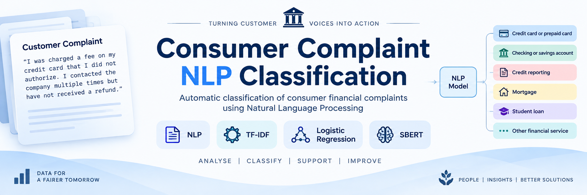

# Consumer Complaint NLP Classification



## Project Overview

Financial institutions receive large volumes of customer complaints that need to be classified and routed to the appropriate product or service category.

This project develops an end-to-end Natural Language Processing (NLP) classification system that uses consumer complaint narratives to automatically predict the relevant financial product category.

The project compares two approaches:

- TF-IDF + Logistic Regression
- SBERT embeddings + Logistic Regression

The final selected approach is TF-IDF + Logistic Regression.

## Business Problem

Manually reading and categorising large numbers of customer complaints can be time-consuming and difficult to scale.

An automated classification system could support complaint-routing teams by assigning incoming complaints to the appropriate product category, allowing cases to reach the relevant department more quickly.

The system is designed as a decision-support tool rather than a replacement for human review.

## Project Objective

The objective is to develop and evaluate an NLP-based multiclass classification system that predicts the product category of consumer financial complaints.

## Research Question

**How effectively can NLP-based text classification models categorise consumer financial complaints based on their complaint narratives?**

## Dataset

The project uses the **Consumer Complaint Database** from the Consumer Financial Protection Bureau (CFPB), accessed through Kaggle.

The dataset contains consumer complaints relating to financial products and services.

For this project, the complaint narrative is used as the main text input and the product category is used as the target variable.

A stratified sample of 20,000 complaints with available narratives was used for modelling.

## NLP Task

This project is formulated as a **multiclass text classification problem**.

### Input

Consumer complaint narrative.

### Output

Predicted financial product category.

The predicted category can act as a routing proxy for directing complaints to the appropriate internal team.

## Methodology

The project follows an end-to-end NLP pipeline:

1. Data collection
2. Data inspection
3. Data cleaning
4. Exploratory data analysis
5. Text preprocessing
6. Train-validation-test splitting
7. TF-IDF feature extraction
8. Logistic Regression classification
9. SBERT embedding generation
10. Model comparison
11. Final model training
12. Evaluation on unseen test data
13. Error analysis
14. Discussion and recommendations

## Text Preprocessing

The complaint narratives were prepared for NLP modelling through text cleaning and preprocessing.

The pipeline was designed to produce a consistent text representation while retaining information useful for distinguishing financial complaint categories.

## TF-IDF Model

The baseline model uses **TF-IDF (Term Frequency-Inverse Document Frequency)** to represent complaint narratives numerically.

The representation uses:

- Maximum 5,000 features
- Unigrams and bigrams
- `ngram_range=(1, 2)`

Logistic Regression was then trained on the TF-IDF representation.

Class weighting was used to help address the imbalance between product categories.

## SBERT Model

The second approach uses **Sentence-BERT (SBERT)** to generate semantic text embeddings.

The SBERT embeddings were then provided to a Logistic Regression classifier.

This experiment was used to investigate whether semantic embeddings could improve classification performance compared with the TF-IDF representation.

## Model Comparison

| Model | Validation Accuracy | Validation Macro-F1 |
|---|---:|---:|
| TF-IDF + Logistic Regression | 79.53% | 72.78% |
| SBERT + Logistic Regression | 77.00% | 70.53% |

The TF-IDF approach produced higher validation accuracy and macro-F1 than the tested SBERT approach.

Therefore, TF-IDF + Logistic Regression was selected for the final evaluation.

## Final Model Performance

The selected model was retrained using the combined training and validation data.

Performance on 3,000 previously unseen test complaints:

| Metric | Result |
|---|---:|
| Accuracy | **78.47%** |
| Macro-F1 | **71.18%** |

Macro-F1 is particularly useful because the product categories are imbalanced and gives equal importance to each category.

## Error Analysis

The model performed particularly well for several categories, including:

- Mortgage — F1: 0.89
- Credit reporting — F1: 0.82
- Student loan — F1: 0.82

Lower performance was observed for:

- Other financial service — F1: 0.40
- Money transfer or virtual currency — F1: 0.60

The confusion matrix also showed overlap between categories such as Credit reporting and Debt collection.

These errors are likely related to overlapping terminology and fewer examples in some minority categories.

## Key Findings

- TF-IDF + Logistic Regression achieved stronger validation performance than the tested SBERT approach.
- The final model achieved 78.47% accuracy and 71.18% macro-F1 on unseen test complaints.
- The model performs better on several larger or more clearly defined categories.
- Minority and semantically overlapping categories remain more difficult to classify.
- A relatively simple TF-IDF approach can provide a useful baseline for financial complaint classification.

## Limitations

- The project uses a 20,000-record sample rather than all available complaints with narratives.
- Product categories remain imbalanced.
- Only the complaint narrative was used for classification.
- A random stratified split was used rather than a time-based split.
- Future complaint data may have different characteristics from the historical test data.
- The SBERT experiment used pre-trained embeddings with Logistic Regression rather than transformer fine-tuning.
- Real-world complaint data may contain sensitive information and would require appropriate privacy and data-governance controls.

## Recommendations

For a potential real-world application:

- Use the model as a first-stage complaint-routing tool.
- Automatically route high-confidence predictions while sending uncertain cases for manual review.
- Monitor complaint volumes and category patterns over time.
- Evaluate the model regularly using newer complaint data.
- Consider additional complaint fields such as issue, sub-product, or company.
- Explore richer NLP models and transformer fine-tuning for future improvements.

## Technologies Used

- Python
- Pandas
- NumPy
- Scikit-learn
- NLTK
- Sentence Transformers
- TF-IDF
- Logistic Regression
- SBERT
- Matplotlib
- Seaborn
- Jupyter Notebook

## Repository Structure

```text
Consumer-Complaint-NLP-Classification/
│
├── Consumer_Complaint_NLP.ipynb
├── Consumer_Complaint_NLP.html
└── README.md
